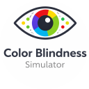

# TheWCAG Color Blindness Simulator

A production-grade Chrome extension for simulating various types of color vision deficiency. Test your website's accessibility by previewing how users with color blindness see your content.



## Features

### Core Functionality

- **8 Simulation Types**: Protanopia, Protanomaly, Deuteranopia, Deuteranomaly, Tritanopia, Tritanomaly, Achromatopsia, and Achromatomaly
- **Real-time Filtering**: Apply color blindness filters instantly to any webpage
- **Severity Control**: Adjust the intensity of anomaly-type filters (0-100%)
- **Keyboard Shortcut**: Toggle filters quickly with `Alt+Shift+C`

### Color Blindness Types Supported

| Type | Affected | Description |
|------|----------|-------------|
| **Protanopia** | Red cone | Complete red-blindness (~1% of males) |
| **Protanomaly** | Red cone (weak) | Reduced red sensitivity (~1% of males) |
| **Deuteranopia** | Green cone | Complete green-blindness (~1% of males) |
| **Deuteranomaly** | Green cone (weak) | Most common form (~5% of males) |
| **Tritanopia** | Blue cone | Complete blue-blindness (rare) |
| **Tritanomaly** | Blue cone (weak) | Reduced blue sensitivity (rare) |
| **Achromatopsia** | All cones | Complete color blindness (very rare) |
| **Achromatomaly** | All cones (weak) | Partial color blindness (very rare) |

### User Experience

- **Quick Toggle**: Enable/disable simulation with one click
- **Filter Info**: Learn about each type of color blindness
- **Dark Mode**: Full dark mode support
- **Persistent Settings**: Remember your preferences

### Developer Tools

- **DevTools Panel**: Integrated panel in Chrome DevTools (F12 > Color Blindness tab)
- **Quick Select Grid**: Rapidly switch between different filter types
- **Per-site Settings**: Optionally remember filter settings for specific websites

## Installation

### Development

1. Clone the repository:
   ```bash
   git clone https://github.com/WOLFIEEEE/ColorBlindness-Extension.git
   cd ColorBlindness-Extension
   ```

2. Install dependencies:
   ```bash
   npm install
   ```

3. Build the extension:
   ```bash
   npm run build
   ```

4. Load in Chrome:
   - Open `chrome://extensions/`
   - Enable "Developer mode" (top right)
   - Click "Load unpacked"
   - Select the `dist` folder

### From Chrome Web Store

Coming soon!

## Usage

### Popup Panel

Click the extension icon in your toolbar to open the popup panel:

1. **Simulator Tab**: Select a color blindness type and enable simulation
   - Choose from dropdown or use the info section to learn about each type
   - Adjust severity for anomaly types
   - Toggle simulation on/off

2. **Info Tab**: View detailed information about the selected filter
   - Description of the condition
   - Affected cone type
   - Population prevalence
   - Colors that may appear similar

3. **Settings Tab**: Customize extension behavior
   - Set default filter type
   - Toggle dark mode
   - Auto-apply on page load
   - Export/import data

### DevTools Panel

1. Open Chrome DevTools (`F12` or `Cmd+Option+I`)
2. Navigate to the "Color Blindness" tab
3. Use the quick select grid for rapid testing
4. View detailed info about each filter type

### Keyboard Shortcut

Press `Alt+Shift+C` to toggle the current filter on/off.

## How It Works

The extension uses **SVG Color Matrix Filters** to simulate color blindness. These filters are based on research by Brettel, Viénot and Mollon (1997) and are applied to the entire page using CSS filters.

```css
html {
  filter: url(#colorblind-filter);
}
```

This approach is:
- **GPU-accelerated**: Filters use hardware acceleration
- **Zero JavaScript overhead**: No per-frame processing
- **Accurate**: Based on scientific color vision research

## Tech Stack

- **Build**: Vite 5 + CRXJS (Chrome Extension Plugin)
- **UI**: React 18 + TypeScript (strict mode)
- **Styling**: Tailwind CSS 3
- **State**: React hooks + Chrome Storage API
- **Testing**: Vitest

## Project Structure

```
ColorBlindness-Extension/
├── src/
│   ├── popup/              # Extension popup UI
│   │   ├── components/
│   │   │   ├── PopupApp.tsx       # Main popup component
│   │   │   ├── FilterSelector.tsx # Filter type dropdown
│   │   │   ├── FilterToggle.tsx   # Enable/disable toggle
│   │   │   ├── SeveritySlider.tsx # Intensity control
│   │   │   ├── FilterInfo.tsx     # Filter information
│   │   │   ├── Settings.tsx       # Settings panel
│   │   │   └── ...
│   │   └── popup.tsx              # Entry point
│   ├── devtools/           # DevTools panel
│   │   └── components/
│   │       └── DevToolsPanel.tsx  # Full DevTools UI
│   ├── content/            # Content script
│   │   └── content.ts             # Filter injection
│   ├── background/         # Service worker
│   │   └── service-worker.ts      # State management
│   ├── lib/                # Core utilities
│   │   ├── colorblind-filters.ts  # Filter algorithms
│   │   ├── storage.ts             # Chrome storage wrapper
│   │   └── __tests__/             # Unit tests
│   └── styles/
│       └── globals.css            # Tailwind + custom styles
├── public/icons/           # Extension icons
├── manifest.json           # Chrome extension manifest v3
└── package.json
```

## Scripts

```bash
# Development
npm run dev          # Start Vite dev server with HMR

# Build
npm run build        # TypeScript check + production build

# Testing
npm run test         # Run tests in watch mode
npm run test:run     # Run tests once

# Code Quality
npm run lint         # Check for linting errors
npm run lint:fix     # Auto-fix linting errors
npm run typecheck    # TypeScript type checking
```

## Browser Compatibility

- **Chrome**: 95+ (required for CSS filter support)
- **Edge**: 95+ (Chromium-based)
- **Brave**: 1.32+ (Chromium-based)

**Note**: The extension cannot access:
- Chrome internal pages (`chrome://`)
- Chrome Web Store
- Other extension pages

## Privacy

This extension stores all data locally on your device. We do not collect, track, or share any personal information.

See our full [Privacy Policy](PRIVACY.md) for details.

## License

Proprietary License - See [LICENSE](LICENSE) file for details.

Copyright (c) 2024 TheWCAG.com. All rights reserved.

## Links

- [TheWCAG.com](https://thewcag.com) - Full WCAG reference and tools
- [WCAG 2.2 Guidelines](https://www.w3.org/TR/WCAG22/)
- [Understanding Use of Color](https://www.w3.org/WAI/WCAG21/Understanding/use-of-color.html)
- [Report Issues](https://github.com/WOLFIEEEE/ColorBlindness-Extension/issues)

## Changelog

### v1.0.0

- Initial release
- 8 color blindness simulation types
- Real-time page filtering with SVG color matrices
- Severity control for anomaly types
- DevTools panel with quick select grid
- Keyboard shortcut support
- Dark mode support
- Per-site filter settings
- Export/Import functionality

---

Built with care for accessibility by [TheWCAG.com](https://thewcag.com)
